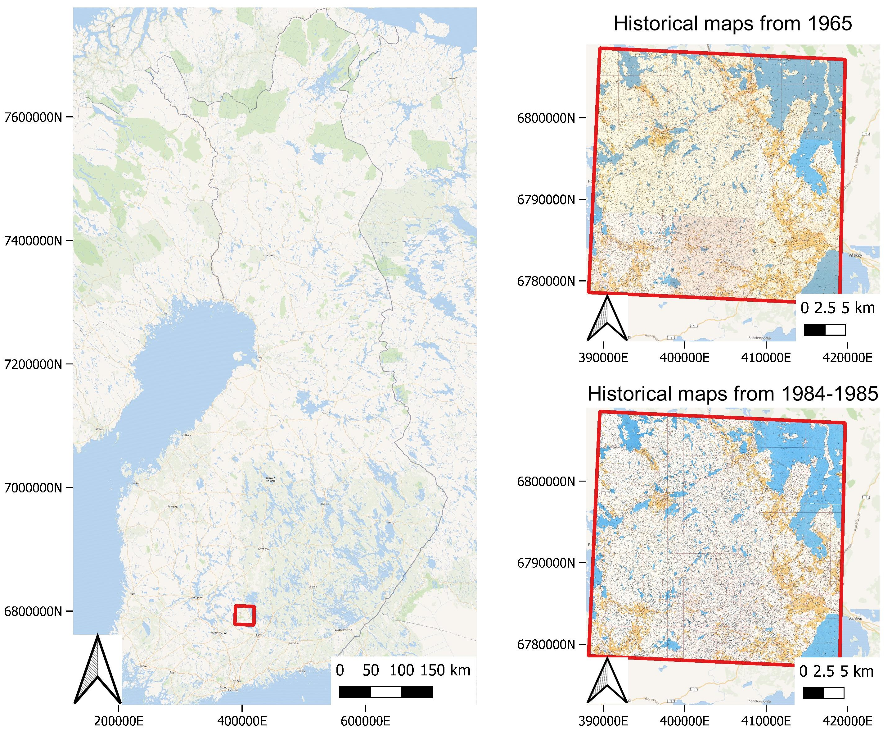

# Utilizing historical maps in identification of long-term land use changes

## Abstract

> Anthropogenic land cover/use change is a significant threat to habitats and ecosystems. . Knowledge in the magnitude and historical trends in land cover is needed to understand the changing status of the key elements of the landscape and to better target management efforts. However, this information was not easily available before the start of satellite mapping campaign scheme. Further, coarse-resolution satellite data does not allow detection of small or narrow elements in the landscape. We extracted data from old topographic maps to examine long-term land cover changes. As a case study, we utilized old digital maps (1965, 1984 and 1985) and topographic databases (2005 and 2022) to evaluate changes in the arable land cover and the density of linear water elements (ditches and streams) in an area characterized by modern forest management and forest-agricultural land transitions located in southern boreal region in Finland. 

## Data used

The study area is located in the vicinity of Evo, Finland, and consists of 9 map sheets. From each map sheet, we have two different historical scanned maps, older from 1965 and newer from either 1984 or 1985. The maps were provided by [National Land Survey of Finland](https://www.maanmittauslaitos.fi/en/e-services/old-printed-maps), and the ground control points for each individual map were acquired from [vanhatkartat.fi](https://vanhatkartat.fi) by Shingle Oy. Reference data from 2005 and 2022 is based on topographic database by NLS Finland, and it can be acquired for instance from [Paituli download service](https://paituli.csc.fi/download.html).

## Getting started

Much of the work relies heavily on https://github.com/jaeeolma/drone_detector, and instructions for its installation work here also.

## Authors

* Janne Mäyrä (coresponding author), Finnish Environment Institute SYKE
* Sonja Kivinen, University of Eastern Finland
* Sarita Keski-Saari, University of Eastern Finland
* Laura Poikolainen, University of Eastern Finland
* Timo Kumpula, University of Eastern Finland

This work is a part of [IBC-CARBON](https://www.ibccarbon.fi/en-US) WP4.